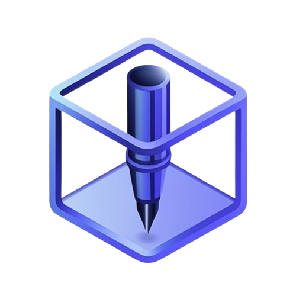
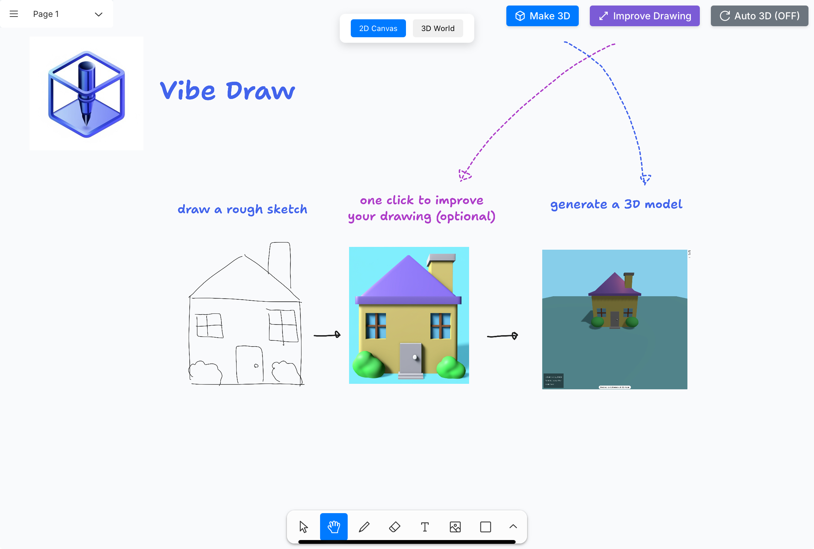
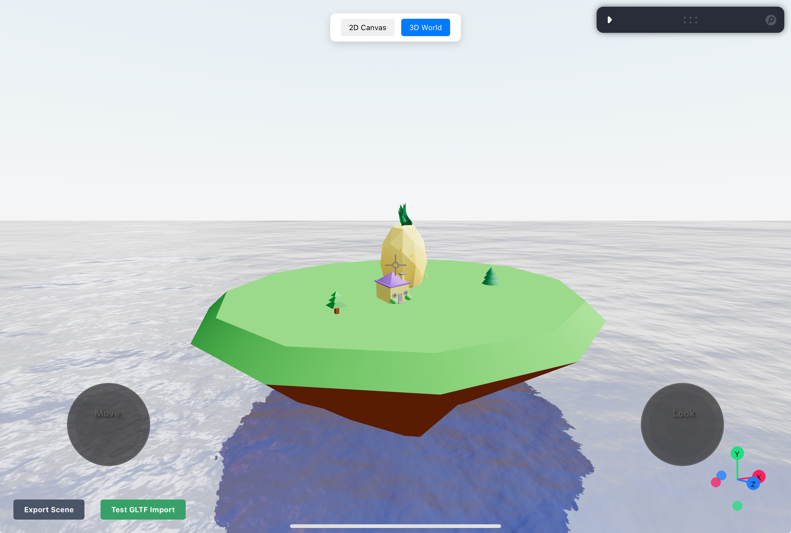

    

<h1 align="center">
    Vibe Draw
</h1>

   turn your roughest sketches into stunning 3D worlds by vibe drawing

Winner @ GenAI Genesis 2025

Devpost: https://devpost.com/software/vibe-draw

# Inspiration

Creativity is often constrained by technical skills or complex software. We were inspired by the idea of democratizing 3D creation, making it easy and accessible to anyone, regardless of their artistic or technical abilities.

Our goal is to empower people to freely express their imagination and bring their ideas effortlessly into 3D worlds.

# What it does

Vibe Draw is an intuitive app that transforms your simple hand-drawn sketches and rough writings into polished, colorful 3D models.

Users sketch freely on an infinite 2D canvas, and the AI intelligently converts these sketches into realistic, aesthetically pleasing 3D objects. Users can then seamlessly add their creations to an infinite 3D world, building immersive scenes and environments they can export and share.

# How we built it

We used Next.js and React for our responsive, user-friendly frontend, coupled with Three.js for rendering interactive 3D models.

To convert rough sketches into detailed drawings, we used Gemini Flash 2.0 Experimental, which improved the visual quality and accuracy of user drawings.

Claude Sonnet 3.7 allowed us to effectively prompt Three.js with images and text, dynamically generating accurate 3D models.

Cerebras Llama 3.3 70B was used to rapidly extract individual object code from complex Three.js scenes, allowing for one-click imports in the 3D world.

The backend infrastructure was developed using Python, FastAPI, and Celery to handle asynchronous tasks efficiently.

# Challenges we ran into

One significant challenge was achieving accurate 3D interpretations from varied sketch quality. Ensuring the AI consistently understood users' intent, regardless of drawing precision, required rigorous prompt engineering and a bit of creativity. For instance, we decided to use Gemini 2.0 Flash's multimodal capabilities to generate an intermediate 2D image that builds on the user's rough sketch, in order to provide a better input for the 3D model generation.

# Accomplishments that we're proud of

We’re extremely proud of creating a genuinely intuitive platform that genuinely empowers users of all skill levels. Successfully integrating multiple cutting-edge AI models to work harmoniously in real-time, maintaining smooth, responsive user interactions, and providing high-quality 3D outputs was a deeply challenging problem that we are proud to have tackled.

Most importantly, being able to use our product to effortlessly create vibrant, intricate 3D worlds validated our vision of democratizing digital creativity.

# What's next for Vibe Draw

- Collaborative multi-user worlds, with real-time co-creation
- AR/VR integration to allow users to immerse themselves further into their creations
- Improving the sketch-to-3D translation further

